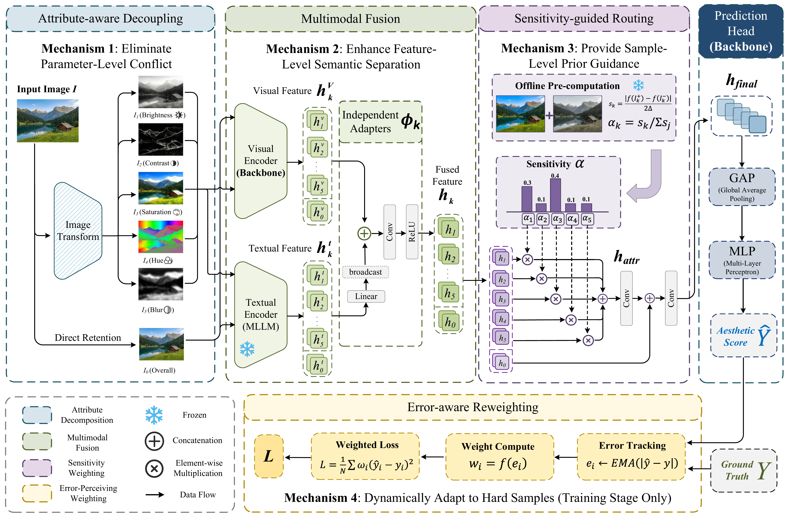

<h1 align="center">AGREE</h1>

<h3 align="center">When Attributes Disagree: Gradient Conflict in Image Aesthetic Assessment</h3>

<p align="center">
  <a href="https://icml.cc/Conferences/2026"></a>
  <a href="https://pytorch.org/"></a>
  <a href="https://www.python.org/"></a>
  <a href="LICENSE"></a>
</p>

<p align="center">
  <b>AGREE</b> (<b>A</b>ttribute-aware <b>G</b>radient conflict <b>RE</b>duction for a<b>E</b>sthetics) is a plug-and-play framework that addresses gradient conflict in Image Aesthetic Assessment (IAA) through attribute-aware decoupling and sensitivity-guided routing.
</p>

---

## 🔥 News

- **[2026.07]** 🎉 Paper accepted at **ICML 2026** (Seoul, South Korea)!
- **[2026.05]** Code and pre-trained models released.

---

## 📋 Abstract

Image Aesthetic Assessment (IAA) predicts an image's overall aesthetic score, yet aesthetics is influenced by multiple attributes whose relative importance varies with image content and usage scenarios. Under end-to-end training with only overall-score supervision, attribute signals are blended, which can cause **gradient conflict** across samples dominated by different attributes, resulting in gradient cancellation and persistent systematic bias.

To address these issues, we propose **AGREE**, which learns attribute-specific subspaces and performs gradient routing based on sample-wise attribute sensitivity estimated via perturbation analysis. AGREE further reduces feature coupling across attributes with semantic anchors and improves robustness via error-aware reweighting.

<p align="center">
  
</p>

---

## ✨ Key Features

| Component | Description | Paper Reference |
|-----------|-------------|-----------------|
| **Attribute-aware Decoupling** | Explicit modeling of 5 attribute dimensions (Brightness, Contrast, Blur, Hue, Saturation) with independent visual features | Eq. (1)(2) |
| **Multimodal Fusion** | Visual-text fusion using LLaVA-extracted semantic anchors | Eq. (3)(4) |
| **Sensitivity-guided Routing** | Dynamic attribute weighting based on perturbation-based sensitivity | Eq. (5)(6)(7)(8) |
| **Error-Aware Reweighting** | EMA-based sample reweighting for hard sample mining | Eq. (10)(11)(12) |

---

## 🚀 Quick Start

### Installation

```bash
# Clone the repository
git clone https://github.com/your-username/AGREE.git
cd AGREE

# Create conda environment
conda create -n IAA python=3.8 -y
conda activate IAA

# Install dependencies
pip install torch torchvision torchaudio
pip install pandas numpy scipy scikit-learn tqdm pyyaml einops
```

### Project Structure

```
AGREE/
├── AADB/                    # AADB dataset experiments
│   ├── EAMB-Net-AGREE/      # EAMB-Net + AGREE
│   └── HKD-IAA-AGREE/       # HKD-IAA + AGREE
├── AVA/                     # AVA dataset experiments
├── LAPIS/                   # LAPIS dataset experiments
├── PARA/                    # PARA dataset experiments
├── TAD66K/                  # TAD66K dataset experiments
└── README.md
```

### Training

```bash
# Example: Train EAMB-Net + AGREE on AADB
cd AADB/EAMB-Net-AGREE
python EAMB_AADB_AGREE_train.py --gpu_id 0
```

### Configuration

Edit `config.yml` to customize training:

```yaml
# Sensitivity-guided Routing
sensitivity_csv_path: 'path/to/sensitivity.csv'

# Error-Aware Reweighting (EA-MSE)
error_aware:
  enabled: true
  beta: 1.0       # Eq.(11): ω_i = 1 + β * tanh(...)
  tau: 0.1        # Eq.(11): temperature parameter
  warmup_epochs: 5
  ema_decay: 0.9  # Eq.(10): γ = 0.9
```

---

## 📊 Results

### Main Results (SRCC / PLCC)

| Method | AVA | LAPIS | PARA | AADB | TAD66K |
|--------|-----|-------|------|------|--------|
| TANet (IJCAI'22) | .684 / .675 | .694 / .706 | .815 / .853 | .564 / .575 | .425 / .457 |
| EAT (MM'23) | .752 / .755 | .802 / .809 | .891 / .924 | .601 / .611 | .476 / .503 |
| ELTA (ICML'24) | .698 / .704 | .686 / .696 | .826 / .851 | .592 / .583 | .413 / .430 |
| EAMB-Net (TIM'24) | .702 / .707 | .823 / .825 | .853 / .876 | .638 / .640 | .427 / .428 |
| HKD-IAA (TMM'24) | .753 / .754 | .781 / .760 | .867 / .899 | .671 / .672 | .395 / .377 |
| AesPrompt (TMM'25) | .724 / .719 | .792 / .812 | .875 / .896 | .562 / .577 | .452 / .475 |
| **AGREE (w/ EAT)** | **.789 / .791** | .853 / .853 | **.911 / .940** | .669 / .678 | **.488 / .511** |
| **AGREE (w/ HKD-IAA)** | .761 / .759 | **.859 / .860** | .879 / .916 | **.682 / .689** | .432 / .458 |
| **Improvement** | **↑4.8%** | **↑4.4%** | **↑2.2%** | **↑1.6%** | **↑2.5%** |

> **Note:** AGREE is a plug-and-play framework integrated with two representative baselines (EAT and HKD-IAA). **Bold** = best, results show SRCC/PLCC.

### Ablation Study (AVA, AGREE + EAMB-Net)

| Dec. | Fused | Weighted | EA-MSE | SRCC | PLCC | MAE | RMSE |
|:----:|:-----:|:--------:|:------:|:----:|:----:|:---:|:----:|
| - | - | - | - | .702 | .707 | .420 | .540 |
| ✓ | | | | .715 | .719 | .411 | .527 |
| ✓ | | ✓ | | .725 | .730 | .395 | .513 |
| ✓ | | ✓ | ✓ | .728 | .735 | .402 | **.504** |
| ✓ | ✓ | ✓ | | .730 | .737 | .393 | .506 |
| ✓ | ✓ | ✓ | ✓ | **.732** | **.740** | **.387** | .505 |

> **Dec.**: Attribute Decoupling; **Fused**: Multimodal Fusion; **Weighted**: Sensitivity Weighting; **EA-MSE**: Error-Aware Loss

### Plug-and-Play Compatibility

AGREE is designed to be **plug-and-play** with existing IAA methods:

```python
from fusion_modules import SensitivityGuidedFusion

# Simply replace your fusion module
self.multimodal_fusion = SensitivityGuidedFusion(
    feature_dim=256,
    output_dim=256,
    sensitivity_csv_path='path/to/sensitivity.csv'
)
```

---

## 🔧 Core Components

### Sensitivity-guided Fusion

```python
class SensitivityGuidedFusion(nn.Module):
    """
    AGREE Sensitivity-guided Routing Module
    
    Paper Section 4.3:
    - Eq.(5): s_k(I) = |f(I^{+k}) - f(I^{-k})| / 2Δ
    - Eq.(6): α_k(I) = s_k(I) / Σs_j(I)
    - Eq.(7): F_attr = Conv(Concat(α_1*h_1, ..., α_5*h_5))
    - Eq.(8): F_final = Conv(Concat(h_0, F_attr))
    """
```

### Error-Aware Reweighting

```python
class ErrorTracker:
    """
    AGREE Error-Aware Reweighting (EA-MSE)
    
    Paper Section 4.4:
    - Eq.(10): e_i^{(t)} = γ * e_i^{(t-1)} + (1-γ) * |y_i - ŷ_i|
    - Eq.(11): ω_i = 1 + β * tanh(max(0, (e_i - μ_g) / (τ * σ_g)))
    - Eq.(12): L = (1/N) * Σ ω̃_i * (ŷ_i - y_i)²
    """
```

---

## 📁 Datasets

We evaluate on five widely used IAA benchmarks covering complementary scenarios:

| Dataset | Description | Train | Val | Test | Total | Score Range | Splits |
|---------|-------------|------:|----:|-----:|------:|:-----------:|:------:|
| **AVA** | Large-scale general benchmark from DPChallenge | 222,383 | 11,707 | 19,805 | 253,895 | [1, 10] | [Link](Datasets_split/AVA) |
| **AADB** | Multi-attribute dataset with 11 photographic attributes | 6,620 | 1,418 | 1,420 | 9,458 | [0, 1] | [Link](Datasets_split/AADB) |
| **TAD66K** | Theme-oriented dataset with 47 theme labels | 46,428 | 9,949 | 9,950 | 66,327 | [0, 10] | [Link](Datasets_split/TAD66K) |
| **PARA** | Personalized dataset with multi-user ratings | 21,854 | 4,683 | 4,683 | 31,220 | [1, 5] | [Link](Datasets_split/PARA) |
| **LAPIS** | Artistic IAA dataset focusing on paintings | 8,205 | 1,173 | 2,345 | 11,723 | [0, 10] | [Link](Datasets_split/LAPIS) |

**Data Splits:** We use a unified 8:1:1 (train:val:test) split with fixed random seed (42). For PARA, we split by unique image name to prevent data leakage across personalized annotations.

---

## 📖 Citation

If you find this work useful, please cite our paper:

```bibtex
@inproceedings{author2026agree,
  title={When Attributes Disagree: Gradient Conflict in Image Aesthetic Assessment},
  author={Author1 and Author2 and Author3},
  booktitle={Proceedings of the 43rd International Conference on Machine Learning (ICML)},
  year={2026},
  address={Seoul, South Korea}
}
```

---

## 🙏 Acknowledgements

This work was partly supported by the National Natural Science Foundation of China (62136002, 62221005, 62576060, and 62306056), the National Natural Science Foundation of Chongqing (CSTB2023NSCQ-LZX0006), respectively.

---

## 📄 License

This project is licensed under the MIT License - see the [LICENSE](LICENSE) file for details.

---

<p align="center">
  <b>AGREE</b> - Resolving Gradient Conflict in Image Aesthetic Assessment
  <br>
  <i>ICML 2026 | Seoul, South Korea</i>
</p>
